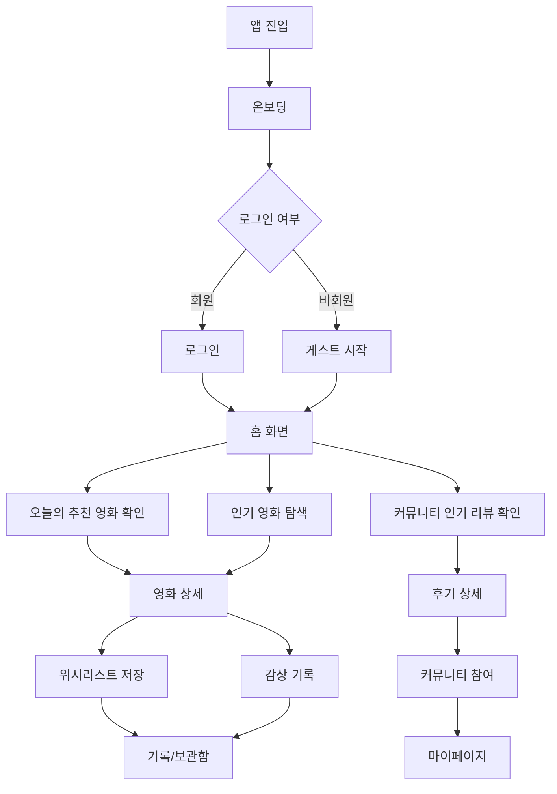
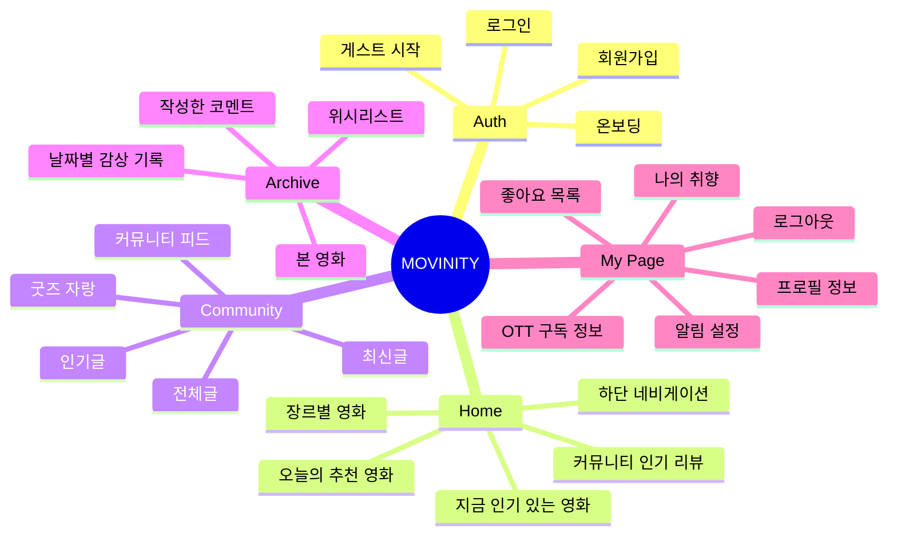
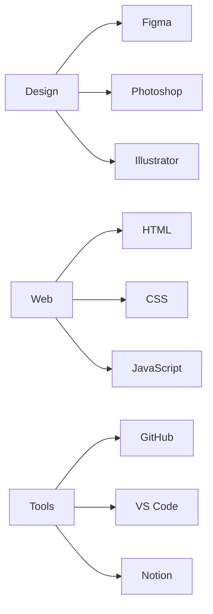
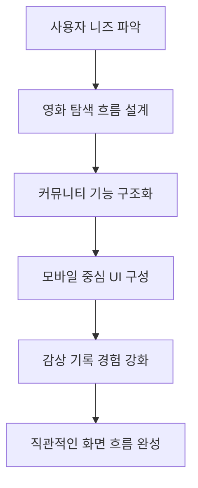
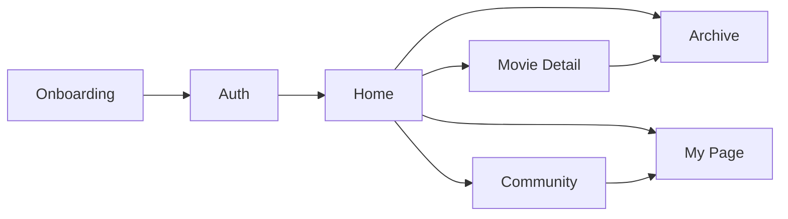
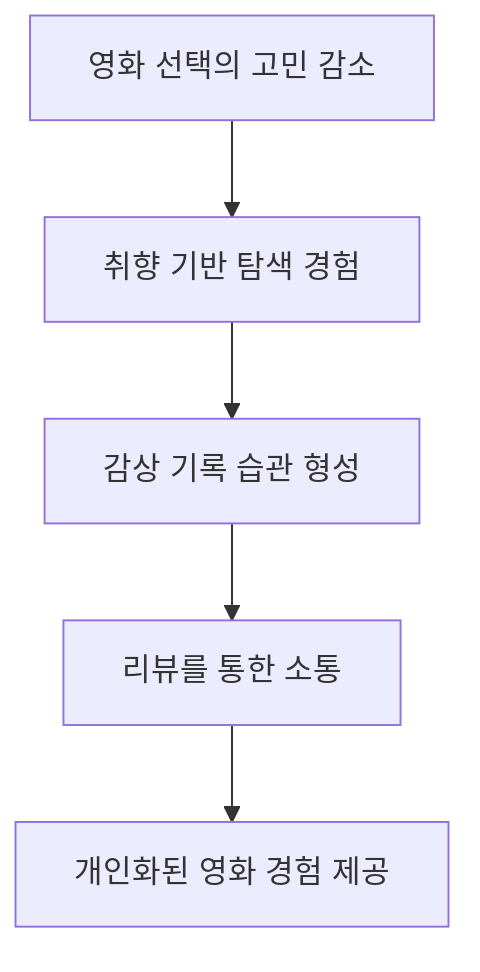

<<<<<<< HEAD
# 🎬 무비니티 MOVINITY

> 영화를 보고, 기록하고, 함께 이야기하는 영화 커뮤니티 앱 디자인 프로젝트

 

## 📌 프로젝트 개요

**무비니티**는 영화 감상 후 리뷰와 취향을 공유할 수 있는 영화 커뮤니티 앱입니다.  
사용자가 영화를 발견하고, 감상을 기록하며, 다른 사용자와 의견을 나눌 수 있도록  
**홈 · 추천 · 커뮤니티 · 기록/보관함 · 마이페이지** 중심의 화면 흐름을 설계했습니다.

 

## 🔗 Links

| 구분              | 링크                                                                                 |
| ----------------- | ------------------------------------------------------------------------------------ |
| GitHub Repository | [무비니티 GitHub 보기](https://github.com/eunjiniii94/movinity.git)                  |
| Design Process    | [무비니티 Notion 보기](https://www.notion.so/UX-UI-a30ecbb9b9f7835790eb0191478bc718) |

 

## 🎯 Project Goal

 

## 👤 주요 사용자 경험

 

## 🧩 서비스 구조

 

## 🖥️ 주요 화면 구성

| 화면              | 설명                                                              |
| ----------------- | ----------------------------------------------------------------- |
| 온보딩            | 앱의 분위기와 핵심 기능을 전달하는 첫 진입 화면                   |
| 로그인 / 회원가입 | 회원과 게스트 사용자를 구분하는 인증 화면                         |
| 홈                | 추천 영화, 인기 영화, 장르별 영화, 인기 리뷰를 탐색하는 메인 화면 |
| 영화 상세         | 영화 정보와 감상 기록, 저장 기능을 제공하는 화면                  |
| 커뮤니티          | 사용자 리뷰와 게시글을 탐색하고 소통하는 화면                     |
| 기록/보관함       | 위시리스트, 본 영화, 작성한 코멘트를 관리하는 화면                |
| 마이페이지        | 프로필, 취향, OTT 구독 정보, 설정을 관리하는 화면                 |

 

## 🛠️ 사용 도구

 

## 🧠 디자인 방향

 

## 💡 핵심 설계 포인트

| 포인트     | 내용                                                            |
| ---------- | --------------------------------------------------------------- |
| 탐색성     | 영화 추천, 인기 영화, 장르별 영화로 다양한 탐색 경로 제공       |
| 기록성     | 본 영화, 위시리스트, 작성한 코멘트를 따로 관리할 수 있도록 구성 |
| 커뮤니티성 | 리뷰와 게시글을 통해 사용자 간 감상 공유 유도                   |
| 접근성     | 게스트 시작 기능을 통해 앱 진입 장벽 완화                       |
| 일관성     | 하단 네비게이션을 기준으로 주요 메뉴 이동 흐름 통일             |

 

## 📱 화면 흐름 요약

 

## ✨ 기대 효과

 

## 📎 작업 프로세스

자세한 기획 과정과 화면 설계는 아래 Notion에서 확인할 수 있습니다.

👉 [무비니티 작업 프로세스 보러가기](https://www.notion.so/UX-UI-a30ecbb9b9f7835790eb0191478bc718)
=======

>>>>>>> 0b27faa67a7e1839277c4ae879762fd92d6a90a4
